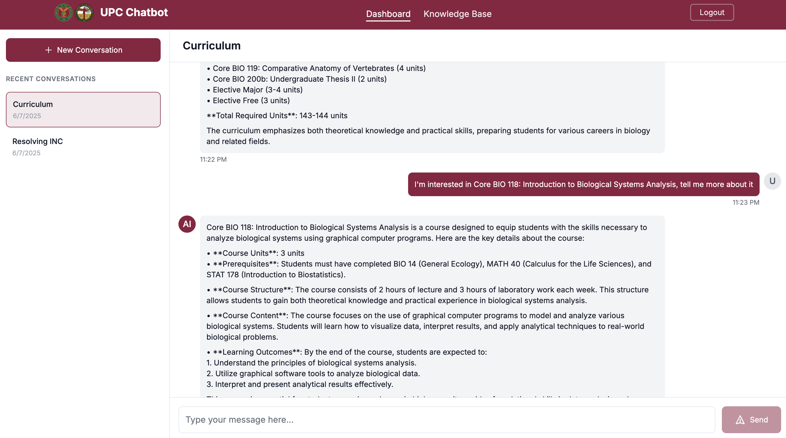
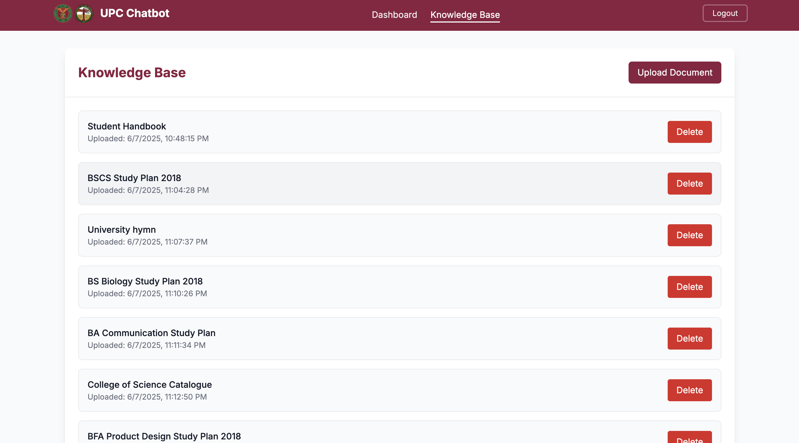
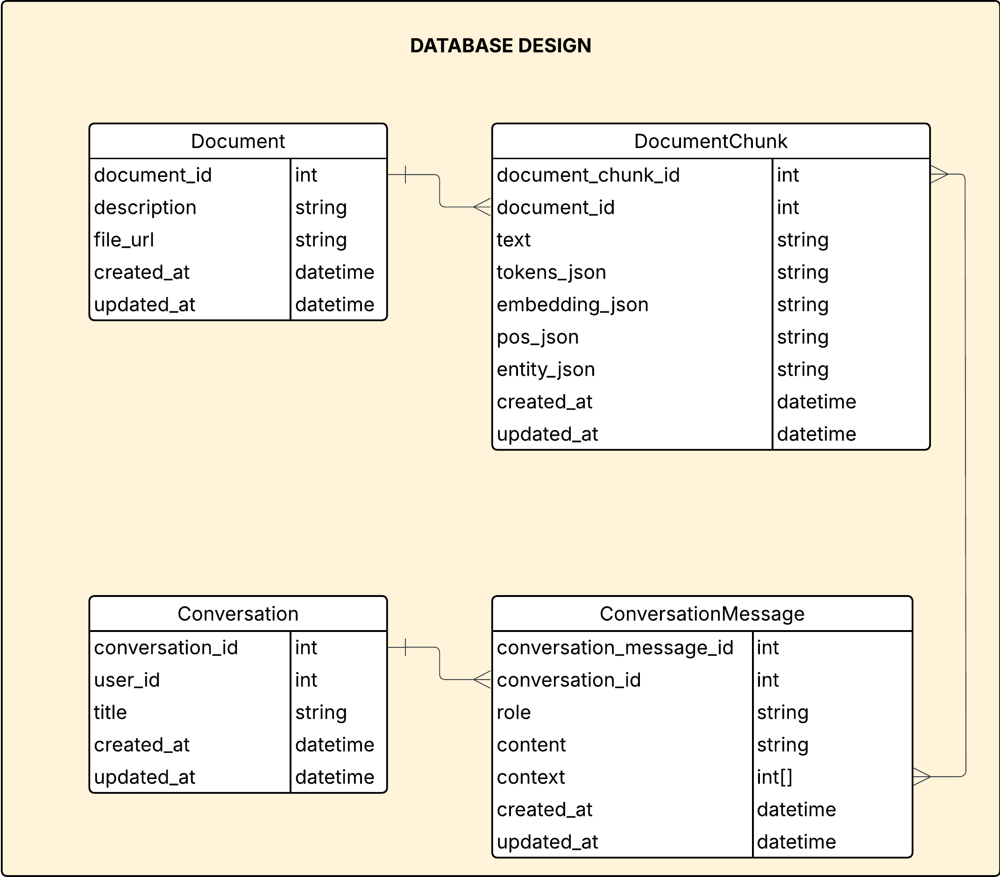
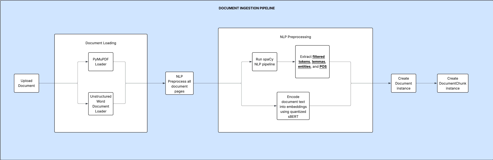
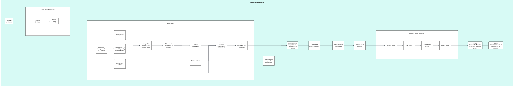

# UPC Chatbot Frontend

A modern web interface for the UP Cebu Student Handbook Chatbot, built with Next.js and Tailwind CSS.

The website is available [here](https://upchat.jed-edison.com)

## Features

- **Modern UI/UX**: Clean and responsive interface using Tailwind CSS
- **Authentication**: Secure login and session management
- **Dashboard**: User-friendly interface for interacting with the chatbot




- **Knowledge Base Management**: Admin interface for managing documents as LLM context



- **File Management**: AWS S3 integration for document upload and management

## Tech Stack

- Next.js 14
- TypeScript
- Tailwind CSS
- AWS SDK for S3 integration


# Core Technology: Hybrid RAG with Sparse and Dense Retrieval

## Database Design



## Document Ingestion Pipeline



The document ingestion pipeline transforms uploaded documents into searchable, AI-ready data through several stages:

1. **Document Loading**: Supports PDF files (via PyMuPDF) and Word documents (via Unstructured loader)
2. **NLP Preprocessing**: Uses spaCy to extract tokens, lemmas, entities, and part-of-speech tags
3. **Text Encoding**: Converts document text into embeddings using quantized sBERT for semantic search
4. **Data Storage**: Creates Document and DocumentChunk instances with processed content and embeddings

This pipeline enables the chatbot to understand document content semantically and provide contextually relevant responses.

## Conversation Pipeline



The conversation pipeline handles user queries through a comprehensive retrieval and generation process:

1. **Input Query**: User submits a question through the chatbot interface
2. **Query Processing**: The query undergoes NLP preprocessing to extract relevant features
3. **Hybrid RAG System**: 
   - **Retrieval Phase**: Uses both sparse (PostgreSQL full-text search) and dense (vector similarity) retrieval methods
   - **Ranking & Selection**: Combines and ranks results from both retrieval methods
4. **Context Assembly**: Builds context from retrieved document chunks and conversation history
5. **LLM Generation**: Uses the assembled context to generate contextually relevant responses
6. **Response Delivery**: Returns the AI-generated answer to the user

This hybrid approach ensures both keyword-based and semantic matching for comprehensive and accurate responses.

# Backend API

Documentation is available [here](https://upchat.maxellmilay.com/api/docs/swagger/) via Swagger

Note:
- All endpoints require user authentication except for login and registration
- Knowledge-base related endpoints require admin authorization

## Getting Started

### Prerequisites

- Node.js 18+
- npm or yarn
- AWS Account (for S3 integration)

### Installation

1. Install dependencies:
```bash
npm install
# or
yarn install
```

2. Create a `.env.local` file in the root directory with the following variables:
```
NEXT_PUBLIC_API_URL=http://localhost:8000
```

3. Start the development server:
```bash
npm run dev
# or
yarn dev
```

Open [http://localhost:3000](http://localhost:3000) with your browser to see the application.

## Project Structure

```
src/
├── app/              # Next.js app directory
├── components/       # Reusable React components
├── contexts/         # State management contexts
└── services/         # API and service integrations
```

## Development

- The application uses Next.js App Router for routing
- Tailwind CSS is used for styling
- TypeScript is used for type safety
- AWS SDK is used for S3 file management

## Building for Production

```bash
npm run build
# or
yarn build
```

## Deployment

The application is deployed to Vercel.

## Contributing

1. Fork the repository
2. Create your feature branch (`git checkout -b feature/AmazingFeature`)
3. Commit your changes (`git commit -m 'Add some AmazingFeature'`)
4. Push to the branch (`git push origin feature/AmazingFeature`)
5. Open a Pull Request
